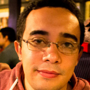
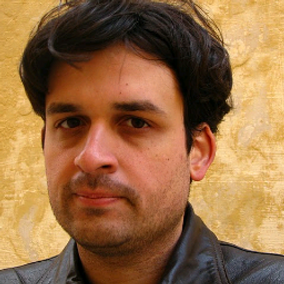
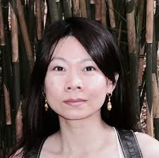

# Question Answering Mediated by Visual Clues and Knowledge Graphs - The Web Conference 2018

## 1. Overview
This challenge focuses on the use of Web data to support semantic Visual Question Answering: given a large image collection, find a set of images matching natural language queries. The task will support advancing the state-of-the-art in Visual Question Answering by focusing on semantic representation and reasoning mechanisms. In order to address natural language queries, participating systems will need to integrate graph descriptors extracted from images to  use structured and unstructured Web data sources. 

## 2. Motivation 
As of 2017, it is estimated that images and videos account for up 73% of all all consumer Internet traffic according to Cisco Visual Networking Index [1]. However, due to its non-symbolic nature, most of the content present in visual form depends on the use of associated textual content or annotations to become accessible and searchable to end users. These associated textual information provide a limited slice to the full information content (such as entities and relations) expressed in the images. With recent advances in machine learning techniques [2,3], in particular, in the field of computer vision, the detection and classification of objects embedded in images became a very active research area [4,5,6]. More recently, the detection of relations between objects in an image scene [7,8,9,10], defined the use of lexico-semantic graphs as a lightweight representation device for images. The emergence of richer symbolic-level representation models opened the doors to more sophisticated semantic interpretation models and applications such as Visual Question Answering (VQA).

However, addressing the problem of Question Answering over visual data requires semantic representation models. These models support semantic approximation and reasoning operations necessary to bridge the gap between queries and the immediate description of an image. Moreover, it requires the integration of the intermediate graph extracted from the image to large commonsense knowledge bases.

This challenge aims at advancing the discussions on the state-of-the-art in these areas, and is creating a test collection which explores the semantic aspects of VQA.

## 3. Challenge Timeline

	* Training data ready and challenges CFP sent : 01 December 2017
	* Challenge papers submission deadline : 12 January 2018
	* Challenge papers acceptance notification : 14 February 2018
	* Challenge test data published : 14 February 2018

## 4. Dataset Description
The test collection consists of 1000 natural language queries divided into training (600 queries) and test (400 queries) sets. All natural language queries will require the integration of one or more knowledge graphs from multiple modalities and will explore different types of representation and reasoning on the top of the scene description (See Section 5). Three data sources will be used: (i) Visual Genome scene graphs (1.7 million of object instances and 2.3 million of relationships) [11], (ii) ConceptNet 5.5 (around 28 million of statements and around 4 million of concepts) [13] and (ii) DBpedia 2016-04 (around 18 million of instances and around 80 million of statements) [14].

## 5. Evaluation Criteria

Participating VQA systems will be evaluated with regard to mean average precision, recall, F1-score, mean reciprocal rank and normalized discounted cumulative gain (NDCG). The challenge will provide Gerbil QA [12] as a supporting evaluation platform. Participating systems will be able to run their webservice against the evaluation platform to test their system against the provided training data and get the correct measures above back. This system ensures long term reproducibility and comparability of evaluation results. GERBIL QA layed the foundation for the H2020 project HOBBIT (https://project-hobbit.eu/) which aims at benchmarking Big Linked Data in a FAIR way. However, to not impose a technical hurdle on the participants, the submissions to the challenges can also happen as file submission in a later announced format.

## 6. Organizers

 

* Fabricio Firmino is a PhD student at Federal University of Rio de Janeiro and partner at Technia, a startup with focus on machine learning. His main research areas include Machine Learning, Content Based Image Retrieval and Semantics Technologies. Fabricio holds BSc. ans MsC in Computer Science from Federal University of Rio de Janeiro. He also has experience such as software engineer and data scientist in companies such as Petrobras (Oil & Gas), Brazilian Navy (Military), Brazilian National Laboratory of Scientific Computing (Research in Bioinformatics), Digital Enterprise Research Institute (Research in Semantics) and Siemens(IT Security).
------

 

* André Freitas is a lecturer at the School of Computer Science at the University of Manchester. Prior to Manchester, he was an associate researcher and lecturer at the Natural Language Processing and Semantic Computing Group at the University of Passau (Germany) at the Chair of Digital Libraries and Web Information Systems. He is also a partner and co-founder at Amtera Semantic Technologies. Before joining Passau, he was part of the Digital Enterprise Research Institute (DERI) at the National University of Ireland, Galway where he did his PhD on Schema-agnostic Query Mechanisms for Large-Schema Databases. André holds a BSc. in Computer Science from the Federal University of Rio de Janeiro (UFRJ), Brazil (2005). His main research areas include Question Answering, Schema-agnostic Database Query Mechanisms, Natural Language Query Mechanisms over Large-Schema Databases, Distributional Semantics, Hybrid Symbolic-Distributional Models, Approximate Reasoning and Knowledge Graphs.
------

 

* Ricardo Usbeck is a PostDoc at the Paderborn University in Germany where he leads the Data Access team at the Data Science chair of Prof. Axel Ngonga. He obtained his PhD from the Leipzig University where he focused on a pipeline from raw unstructured data to a fully-fledged hybrid question answering system. Before  he obtained his B.Sc. and M.Sc. from the University of Halle-Wittenberg focusing on the clustering of tweets and outlier detection in social networks. He currently is interested in building domain-adaptable, hybrid QA systems which are able to overcome the single data source problem as well as FAIR benchmarking of such platforms.
------

 

* Tingting Mu is a lecturer at the School of Computer Science at the University of Manchester, UK. Prior to Manchester, she was a lecturer at the University of Liverpool, UK. Before that, she was a postdoctoral researcher in National Centre of Text Mining, UK. She received her B.Eng. degree from School of the Gifted Young, University of Science and Technology of China in 2004, and Ph.D. degree from Department of Electrical Engineering and Electronics, University of Liverpool in 2008. Her main research areas include machine learning and data analytics, with applications to language and vision understanding. Her research works are focused on developing advanced mathematical modelling and large-scale optimisation techniques to analyse real-world complex data. She is interested in developing algorithms to discover latent structure, learn knowledge representation, and extract information from large-scale, noisy, (un)structured data, e.g., text, image, video, signal, network data, supporting development of text mining and computer vision systems and other related research areas such as bioinformatics. 

------

* Alessio Sarullo is a PhD student at the University of Manchester. He obtained his B.Sc degree from the  University of Florence in 2013 and his M.Sc degree in 2016 with a thesis developed under the joint supervision of professors from both the University of Florence and the Technische Universität Dresden. His main research areas include Machine Learning, Computer Vision and Natural Language Processing. His PhD project aims at building a Visual Question Answering system which is able to integrate common knowledge from external sources and work on a semantically richer representation for both question and image, thus being able to provide better answers for question about entities not directly found in the image.

## 7. Contacts
* Fabrício Firmino: firminodefaria@ufrj.br
* Andre Freitas: andrenfreitas@gmail.com

## 8. References
1.   Cisco Visual networking Index. 2016. Forecast and methodology, 2016-2021, white paper. San Jose, CA, USA (2016).

2.   Ji Wan, Dayong Wang, Steven Chu Hong Hoi, Pengcheng Wu, Jianke Zhu, Yong-dong Zhang, and Jintao Li. 2014. Deep learning for content-based image retrieval: A comprehensive study. In Proceedings of the 22nd ACM international conference on Multimedia. ACM, 157–166.

3.   Klaus Greff, Rupesh K Srivastava, Jan Koutník, Bas R Steunebrink, and Jürgen Schmidhuber. 2017.  LSTM: A search space odyssey.  IEEE transactions on neural networks and learning systems (2017).

4.   Jonathan Krause, Justin Johnson, Ranjay Krishna, and Li Fei-Fei. 2016. A hierarchical approach for generating  descriptive image paragraphs. arXiv preprint arXiv:1611.06607 (2016).

5.   Joseph Redmon, Santosh Divvala, Ross Girshick, and Ali Farhadi. 2016. You only look once: Unified, real-time object detection. In Proceedings of the IEEE Conference on Computer Vision and Pattern Recognition. 779–788.

6.   Zhe Wang, Kingsley Kuan, Mathieu Ravaut, Gaurav Manek, Sibo Song, Fang Yuan, Kim Seokhwan, Nancy Chen, Luis Fernando D’Haro Enriquez, Luu Anh Tuan, et al. 2017. Truly Multi-modal  YouTube-8M Video Classification with Video, Audio, and Text. arXiv preprint arXiv:1706.05461 (2017).

7.   Justin Johnson, Ranjay Krishna, Michael Stark, Li-Jia Li, David Shamma, Michael Bernstein, and Li Fei-Fei. 2015. Image retrieval using scene graphs. In Proceedings of the IEEE Conference on Computer Vision and Pattern Recognition. 3668–3678.

8.   Sebastian Schuster, Ranjay Krishna, Angel Chang, Li Fei-Fei, and Christopher D Manning. 2015. Generating semantically precise scene graphs from textual descriptions for improved image retrieval. In Proceedings of the fourth workshop on vision and language, Vol. 2.

9.   Kaiming He, Xiangyu Zhang, Shaoqing Ren, and Jian Sun. 2016. Deep residual learning for image recognition. In Proceedings of the IEEE conference on computer vision and pattern recognition. 770–778.

10.  Danfei Xu, Yuke Zhu, Christopher B Choy, and Li Fei-Fei. 2017. Scene graph generation by iterative message passing. arXiv preprint arXiv:1701.02426 (2017).

11.  Ranjay Krishna, Yuke Zhu, Oliver Groth, Justin Johnson, Kenji Hata, Joshua Kravitz, Stephanie Chen and Li Fei-Fei, 2016. Visual Genome: Connecting Language and  Vision Using Crowdsourced Dense Image Annotations: https://arxiv.org/abs/1602.07332

12.  Usbeck, Ricardo, et al. "Benchmarking Question Answering Systems."

13.  Speer, Robert, Joshua Chin,  and Catherine Havasi, 2017. ConceptNet 5.5: An Open Multilingual Graph of General Knowledge. AAAI. 2017.

14.  Lehmann, Jens, et al. DBPEDIA 2016-4 Statistics. 2016. http://wiki.dbpedia.org/dbpedia-2016-04-statistics

