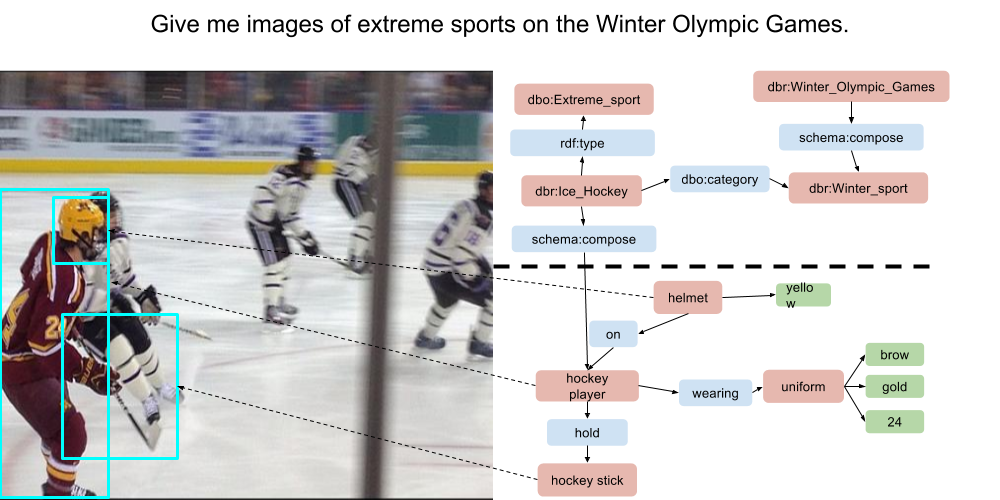

<!-- Global site tag (gtag.js) - Google Analytics -->
<script async src="https://www.googletagmanager.com/gtag/js?id=UA-109499596-1"></script>
<script> 
	document.getElementById("downloads").remove();
	document.getElementsByTagName("h2")[0].remove()

</script>

<script>
  window.dataLayer = window.dataLayer || [];
  function gtag(){dataLayer.push(arguments);}
  gtag('js', new Date());

  gtag('config', 'UA-109499596-1');
</script>

## 1. Overview
This challenge focuses on the use of semantic representation methods to support Visual Question Answering: given a large image collection, find a set of images matching natural language queries. The task will support advancing the state-of-the-art in Visual Question Answering by focusing on methods which explore the interplay between contemporary machine learning techniques, semantic representation and reasoning mechanisms.  

## 2. Motivation 
As of 2017, it is estimated that images and videos account for up 73% of all all consumer Internet traffic according to Cisco Visual Networking Index [1]. However, due to its non-symbolic nature, most of the content present in visual form depends on the use of associated textual content or annotations to become accessible and searchable to end users. These associated textual information provide a limited slice to the full information content (such as entities and relations) expressed in the images. With recent advances in machine learning techniques [2,3], in particular, in the field of computer vision, the detection and classification of objects embedded in images became a very active research area [4,5,6]. More recently, the detection of relations between objects in an image scene [7,8,9,10], defined the use of lexico-semantic graphs as a lightweight representation device for images. The emergence of richer symbolic-level representation models opened the doors to more sophisticated semantic interpretation models and applications such as Visual Question Answering (VQA).

However, addressing the problem of Question Answering over visual data requires principled semantic representation models. These models support semantic approximation and reasoning operations necessary to bridge the gap between queries and the immediate description of an image. In this process the integration of sub-symbolic methods derived from computer vision should be integrated to symbolic AI methods. 

This challenge aims at advancing the dialogue between Computer Vision and Natural Language Processing, by creating a test collection which explores the semantic aspects of VQA.

Topics of interest for the challenge include (but are not restricted to):
	-	Visual Question Answering (QA) architectures and techniques.
	-	Representation learning / Semantic representation models for Visual QA.
	-	Machine learning methods for Visual QA.
	-	Zero and one-shot learning methods.
	-	Use of Web Data and Knowledge Graphs to support Visual QA.
	-	Linguistic resources and datasets.
	-	New evaluation paradigms.


## 3. Challenge Timeline

	* Publication of the training data: December 1st , 2017.
	* Challenge papers submission deadline: February 4th, 2018.
	* Challenge papers acceptance notification: February 14th,  2018.
	* Challenge test data published and submission of results: February 14th, 2018.

## 4. Dataset Description
The test collection consists of natural language queries divided into training and test sets. All natural language queries will require the integration of one or more knowledge graphs from multiple modalities and will explore different types of representation and reasoning on the top of the scene description. The test collection is derived from the Visual Genome Dataset (1.7 million of object instances and 2.3 million of relationships) [11]. 

The train dataset is composed by 4475 queries in a JSON file. Each JSON object is composed by a query and a list of visual genome image ids. For example consider the JSON below:
```json
{  
      "query":"A animal resting.",
      "visual_genome_items":[  
         "2388487",
         "2404815",
         "2398497",
         "2335520",
         "2370203",
         "2417203",
         "2388882"
      ]
   }
```
The set of visual genome ids for query "A animal resting" are stored in visual_genome_items. You can download the data describing each image id from http://visualgenome.org/api/v0/api_home.html. We are using Version 1.2 of dataset completed

[ *CLICK HERE TO DOWNLOD TRAIN DATASET*](https://goo.gl/gZNdRj)





## 5. Evaluation Criteria

Participating VQA systems will be evaluated with regard to mean average precision, recall, F1-score, mean reciprocal rank and normalized discounted cumulative gain (NDCG). The challenge will provide Gerbil QA [12] as a supporting evaluation platform. Participating systems will be able to run their webservice against the evaluation platform to test their system against the provided training data and get the correct measures above back. This system ensures long term reproducibility and comparability of evaluation results. GERBIL QA layed the foundation for the H2020 project HOBBIT (https://project-hobbit.eu/) which aims at benchmarking Big Linked Data in a FAIR way. However, to not impose a technical hurdle on the participants, the submissions to the challenges can also happen as file submission in a later announced format.

## 6. Organizers

	Fabricio Firmino, Federal University of Rio de Janeiro.
	André Freitas, University of Manchester. 
	Ricardo Usbeck, Paderborn University.
	Tingting Mu, University of Manchester.
	Alessio Sarullo, University of Manchester. 

## 7. Contacts
	* Fabrício Firmino: firminodefaria@ufrj.br
	* Andre Freitas: andre.freitas@manchester.ac.uk

## 8. References
1.   Cisco Visual networking Index. 2016. Forecast and methodology, 2016-2021, white paper. San Jose, CA, USA (2016).

2.   Ji Wan, Dayong Wang, Steven Chu Hong Hoi, Pengcheng Wu, Jianke Zhu, Yong-dong Zhang, and Jintao Li. 2014. Deep learning for content-based image retrieval: A comprehensive study. In Proceedings of the 22nd ACM international conference on Multimedia. ACM, 157–166.

3.   Klaus Greff, Rupesh K Srivastava, Jan Koutník, Bas R Steunebrink, and Jürgen Schmidhuber. 2017.  LSTM: A search space odyssey.  IEEE transactions on neural networks and learning systems (2017).

4.   Jonathan Krause, Justin Johnson, Ranjay Krishna, and Li Fei-Fei. 2016. A hierarchical approach for generating  descriptive image paragraphs. arXiv preprint arXiv:1611.06607 (2016).

5.   Joseph Redmon, Santosh Divvala, Ross Girshick, and Ali Farhadi. 2016. You only look once: Unified, real-time object detection. In Proceedings of the IEEE Conference on Computer Vision and Pattern Recognition. 779–788.

6.   Zhe Wang, Kingsley Kuan, Mathieu Ravaut, Gaurav Manek, Sibo Song, Fang Yuan, Kim Seokhwan, Nancy Chen, Luis Fernando D’Haro Enriquez, Luu Anh Tuan, et al. 2017. Truly Multi-modal  YouTube-8M Video Classification with Video, Audio, and Text. arXiv preprint arXiv:1706.05461 (2017).

7.   Justin Johnson, Ranjay Krishna, Michael Stark, Li-Jia Li, David Shamma, Michael Bernstein, and Li Fei-Fei. 2015. Image retrieval using scene graphs. In Proceedings of the IEEE Conference on Computer Vision and Pattern Recognition. 3668–3678.

8.   Sebastian Schuster, Ranjay Krishna, Angel Chang, Li Fei-Fei, and Christopher D Manning. 2015. Generating semantically precise scene graphs from textual descriptions for improved image retrieval. In Proceedings of the fourth workshop on vision and language, Vol. 2.

9.   Kaiming He, Xiangyu Zhang, Shaoqing Ren, and Jian Sun. 2016. Deep residual learning for image recognition. In Proceedings of the IEEE conference on computer vision and pattern recognition. 770–778.

10.  Danfei Xu, Yuke Zhu, Christopher B Choy, and Li Fei-Fei. 2017. Scene graph generation by iterative message passing. arXiv preprint arXiv:1701.02426 (2017).

11.  Ranjay Krishna, Yuke Zhu, Oliver Groth, Justin Johnson, Kenji Hata, Joshua Kravitz, Stephanie Chen and Li Fei-Fei, 2016. Visual Genome: Connecting Language and  Vision Using Crowdsourced Dense Image Annotations: https://arxiv.org/abs/1602.07332

12.  Usbeck, Ricardo, et al. "Benchmarking Question Answering Systems."

13.  Speer, Robert, Joshua Chin,  and Catherine Havasi, 2017. ConceptNet 5.5: An Open Multilingual Graph of General Knowledge. AAAI. 2017.

14.  Lehmann, Jens, et al. DBPEDIA 2016-4 Statistics. 2016. http://wiki.dbpedia.org/dbpedia-2016-04-statistics

